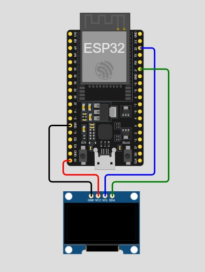

# ESP32 OLED Display Project

This project demonstrates how to connect and display information on a 1.3-inch OLED display using an ESP32 microcontroller.

## Components

* ESP32 (CH340C, USB Type C)
* ESP32 Expansion Board (X0R7 Black)
* OLED Display 1.3-inch White (128x64)
* Breadboard
* Jumper wires (4 pcs, Male to Female)

## Hardware Setup

See the [Hardware Setup](https://github.com/your-username/your-repo-name/wiki/Hardware-Setup) wiki page for detailed instructions on connecting the components.

## Software Setup

**For Arduino IDE Users:**

1.  Open the Arduino IDE.
2.  Copy the code from the `src/main.cpp` file in this repository.
3.  Paste the code into a new Arduino sketch.
4.  Follow the instructions on the [Arduino IDE Setup](https://github.com/your-username/your-repo-name/wiki/Software-Setup---Arduino-IDE) wiki page to install the necessary libraries and configure your board.

**For VS Code with PlatformIO Users:**

1.  Follow the instructions on the [VS Code with PlatformIO Setup](https://github.com/your-username/your-repo-name/wiki/Software-Setup---VS-Code-with-PlatformIO) wiki page to set up your development environment.

## Simulation

**For Arduino IDE Users:**

* Simulate the project using the Wokwi online simulator. See the [Wokwi Simulation](https://github.com/your-username/your-repo-name/wiki/Wokwi-Simulation) wiki page.

**For VS Code Users:**

* Simulate the project using the Wokwi VS Code extension. See the [Wokwi VS Code Extension](https://github.com/your-username/your-repo-name/wiki/Wokwi-VS-Code-Extension) wiki page.

## Troubleshooting

See the [Troubleshooting](https://github.com/your-username/your-repo-name/wiki/Troubleshooting) wiki page for solutions to common issues.

## Code

The code provided in the `src/main.cpp` file demonstrates basic functionality. You can modify it to suit your specific needs.

## Contributing

Contributions are welcome! Please feel free to submit pull requests or open issues.

## License

This project is licensed under the [GPL-3.0](LICENSE) license.